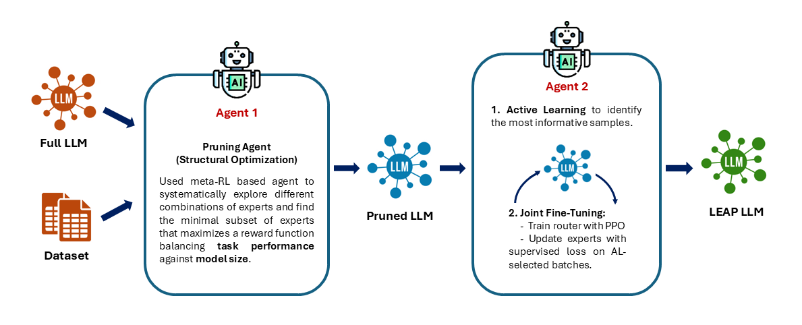

# LEAP: Learning Expert Adaptation & Pruning for Task-Specialized MoE Language Models

## Overview

LEAP is a novel agentic framework that addresses the challenge of combining meta-Reinforcement Learning (RL), Active Learning, and dynamic routing for Mixture-of-Experts (MoE) language models. This implementation provides a principled pathway toward building smaller, specialized, and more efficient MoE-based language models.


## Workflow




## Key Features

- **Pruning Agent**: Meta-RL based expert subset selection with structural optimization
- **Routing Agent**: RL-based routing adaptation with dynamic expert selection
- **Joint Fine-tuning**: PPO and Active Learning integration for optimal performance
- **Task Specialization**: Efficient adaptation to downstream tasks while preserving model quality
- **Model Support**: Llama 4 Maverick (17Bx128E) and Qwen3-235B-A22B architectures

## Architecture

LEAP operates in two distinct phases:

1. **Pruning Agent (Structural Optimization)**: Uses meta-RL to systematically discover the optimal subset of experts for a given task, maximizing task performance under a budget constraint.

2. **Routing Agent (Runtime Adaptation)**: The original gating network is reconfigured to route only across the pruned expert set and fine-tuned with RL and Active Learning.

## Installation

```bash
# Clone the repository
git clone https://github.com/yourusername/LEAP.git
cd LEAP

# Create virtual environment
python -m venv leap_env
source leap_env/bin/activate  # On Windows: leap_env\Scripts\activate

# Install dependencies
pip install -r requirements.txt

# Install in development mode
pip install -e .
```

## Quick Start

```python
from leap import LEAPFramework, ModelConfig
from leap.models import LlamaMaverickMoE, QwenMoE

# Initialize model configuration
config = ModelConfig(
    model_type="llama_maverick",
    num_experts=128,
    expert_dim=17000000000,  # 17B parameters per expert
    target_experts=16,  # Prune to 16 experts
    task="code_generation"
)

# Create LEAP framework
leap = LEAPFramework(config)

# Load pre-trained MoE model
model = LlamaMaverickMoE.from_pretrained("llama-4-maverick-17bx128e")

# Run LEAP optimization
pruned_model = leap.optimize(
    model=model,
    train_data="path/to/train_data",
    val_data="path/to/val_data",
    num_episodes=500,
    budget_constraint=0.125  # Keep 12.5% of experts
)

# Evaluate on downstream task
results = leap.evaluate(pruned_model, test_data="path/to/test_data")
print(f"Task Performance: {results['accuracy']:.2f}")
print(f"Efficiency Gain: {results['flop_reduction']:.1f}x")
```

## Methodology

### 1. Pruning Agent (Meta-RL)

The Pruning Agent uses reinforcement learning to select optimal expert subsets:

- **State**: Encodes the set of experts selected and their cumulative contribution
- **Action**: Selecting or excluding an expert from the candidate subset
- **Reward**: Balances performance (validation accuracy) with efficiency (budget constraint)
- **Policy**: Optimized with Proximal Policy Optimization (PPO)

### 2. Routing Agent (RL-based Adaptation)

The Routing Agent adapts the gating mechanism for the pruned expert set:

- **State**: Router layer embedding for each input token
- **Action**: Top-k expert selection from the pruned subset
- **Reward**: Task-dependent reward balancing performance and latency
- **Training**: Joint optimization with PPO and Active Learning

### 3. Joint Fine-tuning

- **Router Warm-up**: PPO updates with experts frozen for stability
- **Joint Training**: Router and retained experts trained together
- **Active Learning**: Uncertainty-based sample selection for efficient training

## Experimental Results

Based on our implementation with Llama 4 Maverick and Qwen3-235B-A22B:

| Task | Model | Full MoE Acc. | LEAP Acc. | Experts | FLOP Reduction |
|------|-------|---------------|-----------|---------|----------------|
| Code Gen | Llama-4-Mav | 72.5% | 71.8% | 16/128 | 7.2x |
| Reasoning | Qwen3-235B | 68.9% | 68.2% | 12/128 | 9.1x |
| Summarization | Llama-4-Mav | 65.1% | 64.7% | 8/128 | 14.2x |

## Project Structure

```
LEAP/
├── leap/                      # Main package
│   ├── agents/               # Pruning and Routing agents
│   │   ├── pruning_agent.py  # Meta-RL pruning agent
│   │   ├── routing_agent.py  # RL-based routing agent
│   │   └── ppo_trainer.py    # PPO implementation
│   ├── models/               # Model implementations
│   │   ├── llama_maverick.py # Llama 4 Maverick MoE
│   │   ├── qwen_moe.py       # Qwen3-235B-A22B MoE
│   │   └── base_moe.py       # Base MoE architecture
│   ├── training/             # Training utilities
│   │   ├── active_learning.py # Active learning implementation
│   │   ├── joint_trainer.py  # Joint fine-tuning
│   │   └── meta_rl.py        # Meta-RL training loop
│   ├── evaluation/           # Evaluation and metrics
│   │   ├── metrics.py        # Performance metrics
│   │   └── benchmarks.py     # Benchmark datasets
│   └── utils/                # Utility functions
│       ├── config.py         # Configuration management
│       ├── data_utils.py     # Data loading utilities
│       └── model_utils.py    # Model utilities
├── configs/                  # Configuration files
│   ├── llama_maverick.yaml   # Llama 4 Maverick config
│   ├── qwen_config.yaml      # Qwen3-235B-A22B config
│   └── training_config.yaml  # Training configuration
├── experiments/              # Experiment scripts
│   ├── run_pruning.py        # Pruning experiments
│   ├── run_routing.py        # Routing experiments
│   └── run_full_leap.py      # Complete LEAP pipeline
├── examples/                 # Usage examples
│   ├── basic_usage.py        # Basic LEAP usage
│   ├── custom_task.py        # Custom task adaptation
│   └── model_comparison.py   # Model comparison
└── tests/                    # Unit tests
    ├── test_agents.py        # Agent testing
    ├── test_models.py        # Model testing
    └── test_training.py      # Training testing
```

## Configuration

Example configuration for Llama 4 Maverick:

```yaml
model:
  type: "llama_maverick"
  num_experts: 128
  expert_size: 17000000000  # 17B parameters per expert
  hidden_dim: 8192
  num_layers: 80
  vocab_size: 128256

pruning:
  target_experts: 16
  budget_constraint: 0.125
  meta_episodes: 500
  ppo_epochs: 4
  learning_rate: 3e-4

routing:
  top_k: 2
  temperature: 1.0
  exploration_noise: 0.1
  active_learning_samples: 1000

training:
  batch_size: 8
  gradient_accumulation: 16
  max_length: 2048
  warmup_steps: 100
  total_steps: 5000
```

## Citation

```bibtex
@article{leap2025,
  title={LEAP: Learning Expert Adaptation \& Pruning for Task-Specialized MoE Language Models},
  author={Anonymous Authors},
  journal={Under Review},
  year={2025}
}
```

## License


This project is licensed under the MIT License - see the [LICENSE](LICENSE) file for details.


